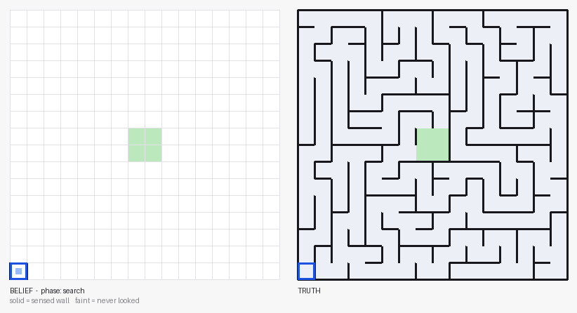
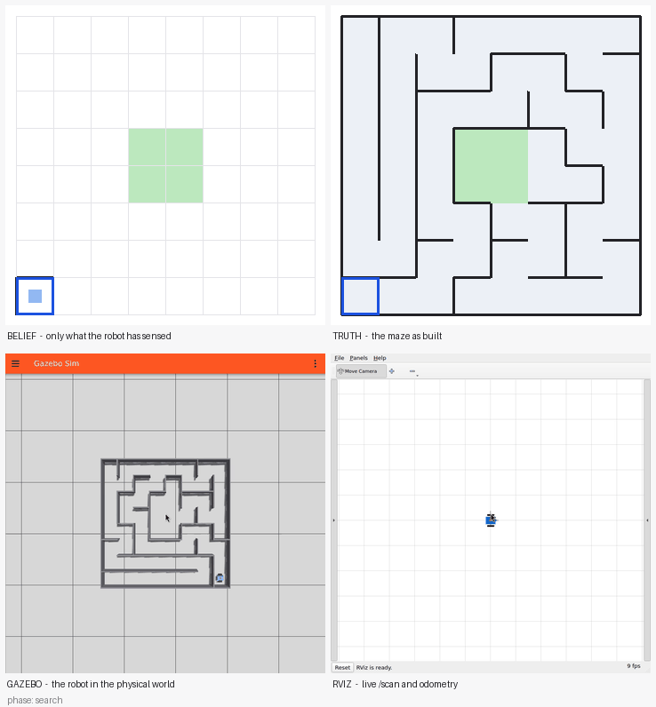

# Micromouse — a robot that discovers the maze it is solving

> A ROS 2 micromouse stack where the robot is given **no map**. It feels out walls one cell at a time with a LiDAR, tracks itself with wheel odometry, builds the maze as it goes, and then runs its own learned map at speed — driving a differential-drive robot in **Gazebo Harmonic** while [mackorone/mms](https://github.com/mackorone/mms) shows what it currently believes.

**Verified end to end:** on a 10×10 maze whose true shortest path is 50 moves, generated from a seed the brain never sees, the robot searches in 50, returns in 50, and runs the learned map in 50 — under closed-loop `/cmd_vel` control with position read back from `/odom`.

<p align="center">
  
  <br/>
  <sub><b>Full run</b> — mms flood-fill distances, gradient walk to the center 2×2, and the Gazebo robot mirroring each cell move.</sub>
</p>

<p align="center">
  
  &nbsp;
  
</p>

<p align="center">
  <a href="#quick-start">Quick start</a> ·
  <a href="#architecture">Architecture</a> ·
  <a href="#demo-recordings">Demos</a> ·
  <a href="#testing">Tests</a> ·
  <a href="docs/DESIGN.md">Design doc</a>
</p>

[](https://docs.ros.org/en/jazzy/)
[](https://gazebosim.org/)
[](https://www.python.org/)
[](LICENSE)

---

## Why this project exists

Classic micromouse implementations weld the solver to a single runtime — you only find out whether the robot reaches the center after a slow, GPU-heavy Gazebo session.

This workspace separates concerns the way competitive micromouse teams do in software:

| Layer | Responsibility | Swappable? |
|-------|----------------|------------|
| **Explorer** (`explorer_brain`) | Belief map, flood-fill, search/return/speed, mms protocol | Runs in mms GUI *or* headless host |
| **Baseline** (`gazebo_sync_brain`) | The same maze solved with the answer already on disk | Kept for comparison |
| **Sensor** (`raycast_lidar`) | Publishes a real `LaserScan` by ray-marching the maze | `lidar:=gz` swaps in Gazebo's `gpu_lidar` |
| **Maze generator** (`generate_maze`) | Seeded maze → `.num`, public spec, truth file, Gazebo world | Single source of truth |
| **Motion** (`cell_motion_controller`) | One mms command → one cell move | `motion:=velocity` drives; `motion:=pose` teleports |
| **Live viz** (`brain_viz`) | Distance grid + path trail from ROS topics | Independent window |

The brain speaks the **mms stdin/stdout text protocol** unchanged. A headless host, the real mms AppImage, or the official mms GUI are interchangeable front-ends.

---

## Architecture

```
                      maze_spec.json                 maze_truth.json
                   (size, start, goal)                   (walls)
                            │                               │
                            ▼                               ▼
        ┌────────────────────────────────┐        ┌──────────────────┐
        │  explorer_brain                │        │ raycast_lidar    │
        │  belief map + flood-fill        │        │ ray-marches the  │
        │  search → return → speed        │        │ real maze        │
        └───┬────────────────────────┬───┘        └────────┬─────────┘
            │ stdout = mms protocol  │                     │ /scan
            ▼                        │ /maze/mms_command   │
     ┌─────────────┐                 ▼                     │
     │  mms GUI    │        ┌────────────────────┐         │
     │  = BELIEF   │        │ cell_motion_       │◄────────┘
     │  (setWall)  │        │ controller         │
     └─────────────┘        │ /cmd_vel → wheels  │
                            │ /odom   → position │
                            └─────────┬──────────┘
                                      ▼
                               Gazebo Harmonic
                               = GROUND TRUTH
```

The brain and the simulator read **different files**. That is the whole point: mms shows what the robot believes, Gazebo shows what is actually there, and you watch the two converge.

**Key design choices**

1. **The explorer cannot see the maze.** The generator writes two files: `maze_spec.json` (size, cell geometry, start, goal — **no walls**) and `maze_truth.json` (the walls). `explorer_brain` reads only the public one, and `spec.read_public()` *raises* on a file containing walls, so pointing it at the truth file fails loudly instead of quietly cheating. Everything it knows about walls came from `/scan`.
2. **Three phases, like a competition micromouse.** Search to the goal on an optimistic map (unsensed walls assumed open — that optimism is what pulls the robot into unexplored ground), return to the start still sensing, then a speed run on a *pessimistic* map that only uses passages actually verified.
3. **Strict lockstep.** The explorer cannot know move *n+1* until the robot has physically arrived at cell *n* and taken a reading there. Send one command → wait for `/maze/step_complete` → wait for consecutive scans to agree → learn → re-flood → decide.
4. **Closed-loop motion.** `motion:=velocity` publishes `/cmd_vel` and reads back `/odom`; position is earned from odometry rather than asserted. `motion:=pose` keeps the old teleport for recording on a host too slow to drive in real time.
5. **The old brain is still here, on purpose.** `gazebo_sync_brain` reads every wall up front and fires the whole solution in one burst. It is the omniscient baseline the explorer is measured against.

See [docs/DESIGN.md](docs/DESIGN.md) for coordinate conventions, topic contracts, and failure modes.

---

## Quick start

**Prerequisites:** Ubuntu 24.04 + [ROS 2 Jazzy](https://docs.ros.org/en/jazzy/Installation.html), Gazebo Harmonic (`ros-jazzy-ros-gz`), Python 3.12, [mms AppImage](https://github.com/mackorone/mms/releases).

```bash
# Build
cd micromouse_ws
colcon build --symlink-install --packages-select micromouse
source install/setup.bash

# Generate a 16×16 maze (omit --seed for one nobody has seen)
ros2 run micromouse generate_maze --seed 42 --top-down-cam
```

### Fastest way to watch it work

No Gazebo, no mms, no GUI — the real brain and the real sensor against a
kinematic stand-in for the robot's legs:

```bash
python3 scripts/run_explorer_headless.py
```

It prints the three phases and a metrics summary. `--noise 0.01` adds a
centimetre of LiDAR noise; the run is unchanged, because the wall decision
takes the median of each sector.

### Terminal 1 — simulation

```bash
source /opt/ros/jazzy/setup.bash
source install/setup.bash
ros2 launch micromouse maze_gazebo.launch.py steps:=2 step_dt:=0.01
```

Wait ~10 s for the robot to spawn at the bottom-left start cell.

### Terminal 2 — mms GUI

```bash
source /opt/ros/jazzy/setup.bash
source install/setup.bash
~/squashfs-root/AppRun   # mms AppImage
```

In mms: **Maze → Load** `~/.micromouse/maze.num`, set **Mouse → Run command** to point at `explorer_brain` (or `gazebo_sync_brain` for the omniscient baseline):

```bash
bash /path/to/micromouse_ws/src/micromouse/run_brain.sh
```

Click **Run**. Walls appear in the mms window as the robot senses them and the distance field re-settles after every discovery.

Useful launch arguments:

| Argument | Default | Effect |
|---|---|---|
| `motion:=velocity\|pose` | `velocity` | drive the wheels vs. teleport |
| `lidar:=raycast\|gz` | `raycast` | simulated ranges vs. Gazebo's `gpu_lidar` |
| `lidar_noise:=0.01` | `0.0` | metres of Gaussian range noise |

For `lidar:=gz` the world must be generated with `--sensors`, which adds the
Gazebo sensors system. That system initialises the Ogre render engine, so on a
GPU-less host it produces no `/scan` at all — which is exactly why `raycast` is
the default.

> **Habit:** `Ctrl+C` Terminal 1 before each new launch. Never stack two `ros2 launch` sessions.  
> Cleanup one-liner: `pkill -9 -f cell_motion_controller; pkill -9 -f "gz sim"; pkill -9 -f brain_viz; pkill -9 -f gazebo_sync_brain`

> **WSL / no-GPU note:** the Gazebo GUI may print `Failed to load plugin [] … gz_rendering_vendor`
> and show a blank 3D viewport. That is the Ogre render engine, which needs a GPU — it is
> **cosmetic**. The flood-fill brain, the pose-driven motion, and the synthetic overhead
> recordings all run without it (the stack is deliberately pose-driven, not render-driven).
> See [docs/DESIGN.md](docs/DESIGN.md#the-gazebo-3d-viewport-on-wsl--gpu-less-hosts).

---

## Demo recordings

<p align="center">
  
  <br/>
  <sub><b>Belief vs truth.</b> Left is only what the robot has sensed — solid walls are measured, faint ones it has never looked at. Watch the search run feel its way out, the return trip come home, then the speed run draw a single clean line through a map it built itself.</sub>
</p>

<p align="center">
  
  <br/>
  <sub><b>The same run, four ways.</b> Belief and truth on top; below them the robot driving the real maze in Gazebo, and RViz showing live <code>/scan</code> and the odometry trail it is navigating by. 8×8, closed-loop <code>/cmd_vel</code>, 31 moves — the true optimum.</sub>
</p>

```bash
./scripts/record_quad_session.sh --size 8 --seed 5
```

Gazebo and RViz there are real windows, not redraws. They cannot be screen-grabbed
under WSLg — it is rootless, so each app is its own Windows window and the X root
grabs black — so each gets a nested `Xvfb` screen with a tiny window manager, and
`ffmpeg` captures that. Rendering is llvmpipe (software), which is why the maze is
small and the capture rate low.

Record just the belief view (no Gazebo needed — the recorder subscribes to
`/maze/belief`, which is `TRANSIENT_LOCAL`, so it can join late and still get every
frame):

```bash
python3 scripts/record_exploration_gif.py --out media/exploration.gif --every 2 &
python3 scripts/run_explorer_headless.py
```

> **Note:** the GIFs below predate the explorer — they were recorded from the
> **omniscient baseline**, a robot walking a path it already knew. Kept for
> comparison.

Automated capture (headless mms host + live ROS recorder):

```bash
chmod +x scripts/record_full_session.sh
./scripts/record_full_session.sh --seed 42
```

| Artifact | Description |
|----------|-------------|
| [`media/quad.gif`](media/quad.gif) | **Four views** — belief, truth, Gazebo, RViz, one run |
| [`media/exploration.gif`](media/exploration.gif) | **The explorer** — belief vs truth, search → return → speed |
| [`media/micromouse_demo.gif`](media/micromouse_demo.gif) | **Full demo** — autoplays in README (mms GUI + Gazebo solve) |
| [`media/micromouse_demo.mp4`](media/micromouse_demo.mp4) | Same run as MP4 (higher quality download) |
| `media/mms_solve.gif` | Offline mms-style flood-fill animation |
| `media/mms_solved.png` | Final distance grid + optimal path |
| `media/brain_path.gif` | Live brain-window trail during Gazebo run |
| `media/gazebo_path.gif` | Top-down world view with robot icon |

Offline render only (no Gazebo):

```bash
python3 scripts/render_solve_gif.py --seed 42 --gif media/mms_solve.gif
```

---

## Repository layout

```
micromouse_ws/
├── src/micromouse/                 # ROS 2 ament_python package
│   ├── micromouse/
│   │   ├── explorer_brain.py       # BRAIN — sees only /scan, lockstep
│   │   ├── explorer.py             # search / return / speed phases
│   │   ├── belief_maze.py          # tri-state map: unknown / wall / open
│   │   ├── scan_to_walls.py        # LaserScan → front/left/right booleans
│   │   ├── raycast.py              # grid-DDA ray marching (pure)
│   │   ├── raycast_lidar.py        # the sensor node; owns the truth file
│   │   ├── run_metrics.py          # what the run cost
│   │   ├── gazebo_sync_brain.py    # BASELINE — reads the whole maze
│   │   ├── cell_motion_controller.py
│   │   ├── brain_viz.py            # Live flood-fill + path window
│   │   ├── generate_maze.py        # Maze → .num / spec / truth / .world
│   │   ├── flood_fill.py           # Distance field from center goal
│   │   ├── planner.py              # Gradient descent + turn planner
│   │   └── mms_interface.py        # stdin/stdout mms API wrapper
│   ├── launch/maze_gazebo.launch.py
│   ├── description/micromouse.urdf.xacro
│   └── test/                       # pytest suite
├── scripts/
│   ├── record_full_session.sh      # One-shot demo capture
│   ├── render_solve_gif.py
│   ├── record_session_gifs.py
│   └── headless_mms_host.py
├── docs/DESIGN.md
└── media/                          # Demo video + portfolio GIFs
```

---

## Testing

```bash
cd src/micromouse
python3 -m pytest test/ -q          # 163 tests, no ROS or simulator needed
```

The exploration policy is proved offline, against a real generated maze and an
oracle sensor that answers only front/left/right from the robot's current cell:

- 30 seeds × (reaches the goal, returns to start, **never steps through a real wall**, speed run matches the true optimum)
- everything the belief claims to know is checked against the actual maze
- a hand-built **lure maze** — a corridor pointing straight at the goal that dead-ends one cell short. Generated mazes never trigger backtracking (recursive-backtracker passages branch rarely enough that heading for the goal is always right), so without this the dead-end recovery path would be entirely untested. A guard test asserts the fixture is still a trap.
- the anti-cheat boundary, both by behaviour (`read_public` rejects a file with walls) and by a source scan of the modules that must stay blind

Coverage on the new pure modules is 96%; `explorer.py` and `belief_maze.py` are at 100%.

---

## Coordinate conventions

| Concept | Value |
|---------|-------|
| Grid | 16×16, origin bottom-left |
| Start | `(0, 0)` facing **North** (+y) |
| Goal | Center 2×2: `(7,7)…(8,8)` |
| Cell size | 0.30 m (Gazebo) |
| Headings | N=+y, E=+x, S=−y, W=−x |

Aligned with [mackorone/mms](https://github.com/mackorone/mms) and standard micromouse competition layout.

---

## Acknowledgements

- **[mackorone/mms](https://github.com/mackorone/mms)** — Micromouse simulator and Mouse stdin/stdout API.
- **ROS 2 Jazzy + Gazebo Harmonic** — Simulation and middleware stack.

---

Built with flood-fill · the mms protocol · and a robot that does not know it is in a maze until the distances appear.
